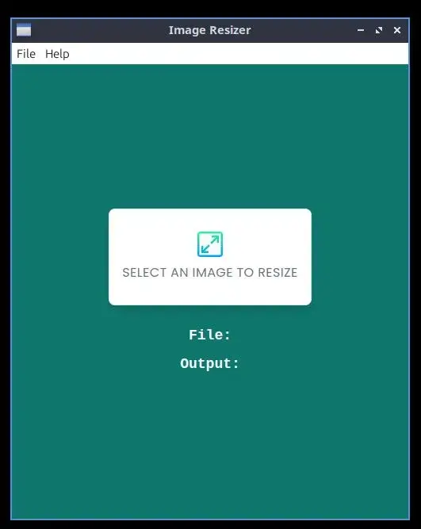
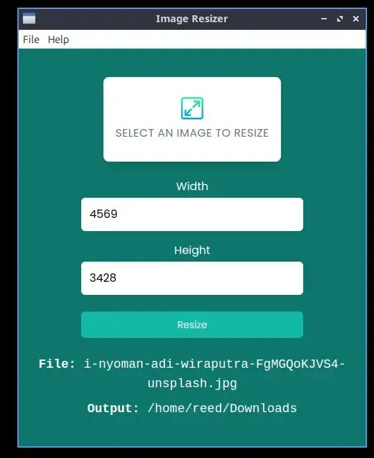

# Image resizer

Made with ElectronJS. A simple image resizer. I'm going to add more features.
Already tested for production.

### What to add:

1. Image type conversion (webp, png, jpg).
2. Compress image size to save space.

